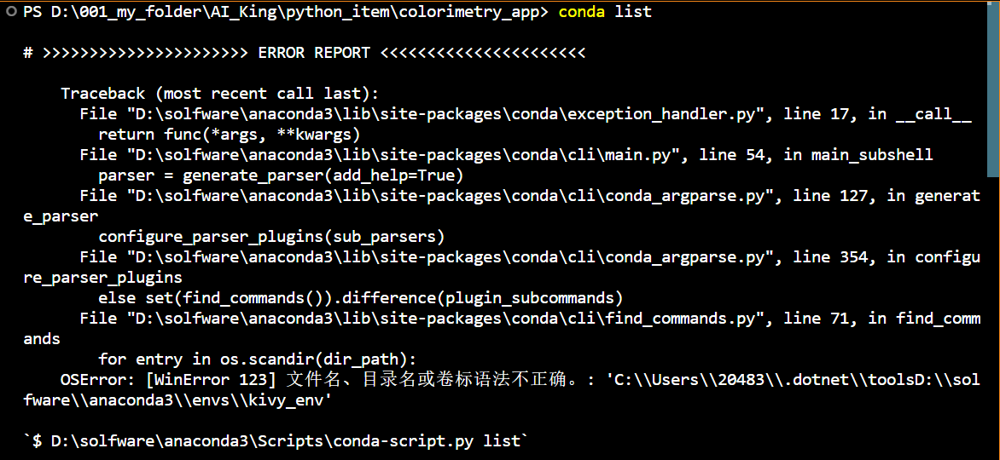

# VSCode中conda指令报错[WinError123]

## 1、问题详情

```python
OSError: [WinError 123] 文件名、目录名或卷标语法不正确。: 
'C:\\Users\\XXXX\\.dotnet\\toolsD:\\solfware\\anaconda3'
```



## 2、解决方法

这是由于插件引起的错误，使用"--no-plugins"暂时停用conda外部插件即可，如：

```python
conda --no-plugins list
```
