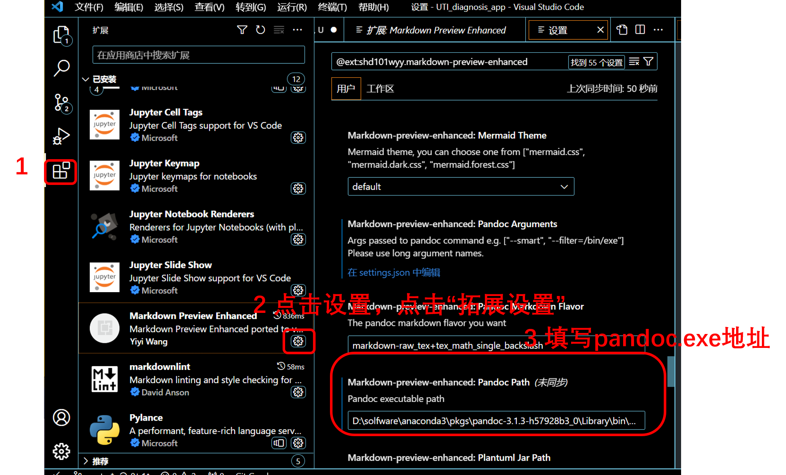

# vscode中markdown编写环境搭建(可转换成pdf,word,HTML)

## 一、下载相关拓展

- Markdown Preview Enhan
  可预览md文件，并导出PDF,word,html等文件格式。  
- markdownlint  
 用于 检查markdown语法错误。
  
## 二、pandoc配置

==不需要转word的无需配置pandoc!!!==

### 1.下载pandoc

- 如果有使用anaconda的话，pandoc一般是自动下载了的，使用以下命令查看或安装：

```python
conda list # 查看是否安装
conda install pandoc # 若无，则安装

# 此时，安装目录一般为:
anaconda安装路径\Library\bin\pandoc.exe。
```

- 如果没有使用anaconda，则需要到[pandoc官网](https://pandoc.org/installing.html)下载安装。记住其安装路径，并找到pandoc.exe文件路径。

### 2.在MPE中填写pandoc地址



### 3.下载MikTex  

[MikTex官网](https://miktex.org/download)  

## 三、导出文件

### 1.导出word

在将markdown文件导为word时，需在markdown文件头部添加以下声明：
具体见[官方文档](https://shd101wyy.github.io/markdown-preview-enhanced/#/zh-cn/pandoc)

```python
---
title: Markdown编辑环境搭建
author: wuqx1999
date: 2023年9月21日
# 指定汉字字体，如果缺少中文显示将不正常
CJKmainfont: 方正苏新诗柳楷简体-yolan
   latex 选项
fontsize: 12pt
linkcolor: blue
urlcolor: green
citecolor: cyan
filecolor: magenta
toccolor: red
geometry: margin=0.3in
papersize: A4
documentclass: article

# pandoc设置
output:
   word_document
   # path: 你想保存的路径，默认与.md文档同文件
# 打印背景色
# 保存文件时自动生成
# export_on_save:
#   pandoc: true
---
```

### 2.导出html

在预览区，右键选择“HTML”或“Open in Brower”,即可。  

### 3.导出pdf

   在浏览器打开导出的HTML，选择“打印”—>“另存为PDF”，并在“更多设置”中勾选“背景图片”，即可得到一个较为美观的PDF。
